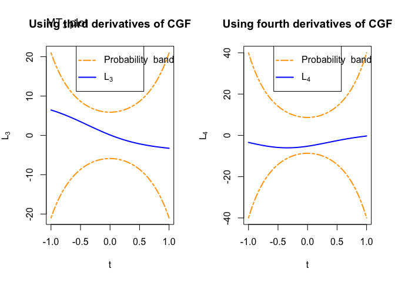

<!-- README.md is generated from README.Rmd. Please edit that file -->

# MvNormTest

<!-- badges: start -->
<!-- badges: end -->

MvNormTest provides graphical techniques to find evidence of
non-normality of a multivariate dataset.

## Installation

You can install the development version of MvNormTest from
[GitHub](https://github.com/) with:

``` r
# install.packages("devtools")
devtools::install_github("HuongTran53/MvNormTest")
```

## Example

This is a basic example which shows you how to solve a common problem:

``` r
library(MvNormTest)
set.seed(1234)
x <- MASS::mvrnorm(1000, rep(0, 5), diag(5))
par(mfrow = c(1, 2))
d3hCGF_plot(x); title("Using third derivatives of CGF")
#> [1] "accept"
d4hCGF_plot(x); title("Using fourth derivatives of CGF")
#> [1] "accept"
```



``` r
## basic example code
```
